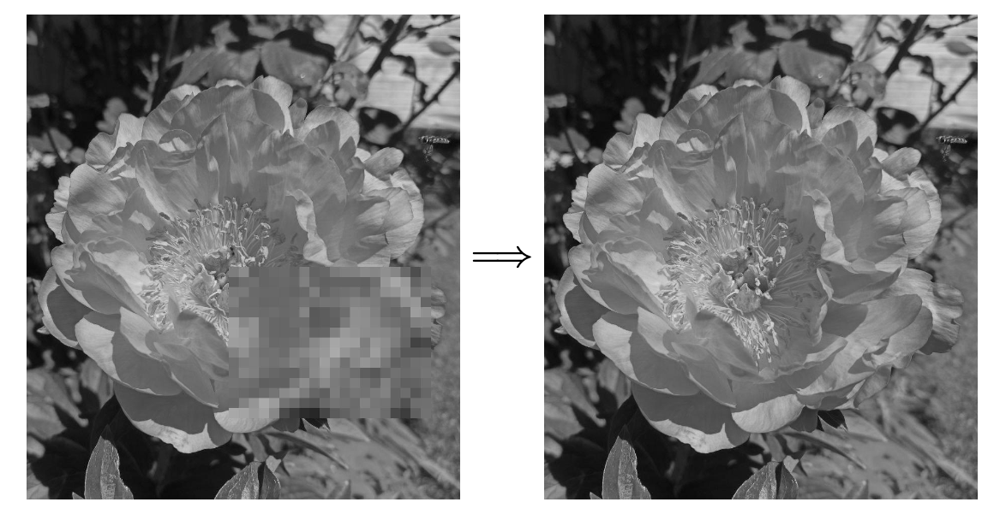

# Image depixelation project

In this repository you can find a project I did in university in the summer term 2022, where the aim was to train a model which can recreate a certain area of an image which was pixelated before being fed into the model. 

The dataset which was used to train the model consisted of 100 images per student, which added up to about 35 000 images. 

Using image augmentation I doubled the amount of images using a little script, which can be found in "image_augmentation.py". Preprocessing of the images was handled by the "prep_image.py", "stack_with_padding.py" and "create_dataset.py" were used to bring the images into datasets which were suitable for PyTorch Dataloaders. 

In the file "model.py" you can find my final model architecture and some prior attempts. The final model architecture is definetely simpler than the others, simply because the more complex models did not perform well due to bad generalization.

In the "model" folder you can find a trained model. On the test data provided by our professors my model had a RMSE Loss of 14 after training for about 30 hours. This means that on every pixel value that was recreated, with values from 0 to 255 my model was off by 14 on average. This got me in Top 30 of more than 250 students.

